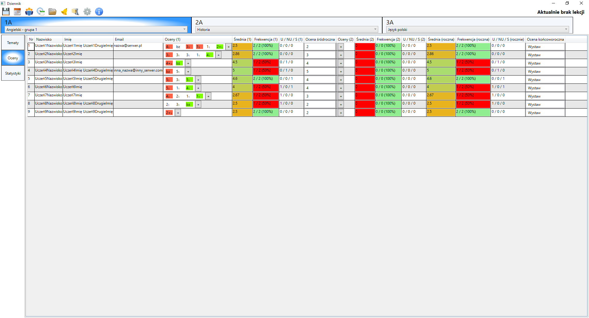

Dziennik szkolny offline. Więcej informacji w Dokumentacja/Obsługa Dziennika.pdf

Najważniejsze funkcje:

- Kalendarze roku szkolnego
- Godziny dzwonków
- Podział klas na grupy (przedmioty)
- Ustalanie tematów na rok szkolny
- Plan lekcji
- Dodawanie ocen i uwag pojedynczo lub seryjnie
- Kolorowanie średniej ocen
- Oceny śródroczne i końcoworoczne
- Kategorie ocen
- Wagi ocen
- Powiadomienia
- Statystyki na miesiąc / półrocze / cały rok - średnia frekwencja/ocen/ocen wystawionych, liczba zrealizowanych tematów
- Liczba zrealizowanych tematów
- Powiadomienie o niezrealizowaniu tematu
- Liczba pozostałych lekcji do końca roku
- Archiwizacja bazy danych
- Powiadomienie dźwiękowe o końcu lekcji i przerwy
- Blokada programu na hasło po nieaktywności oraz przy uruchomieniu
- Automatyczne aktualizacje
- Zabezpieczenie przed uruchomieniem dwóch instancji programu
- inne

